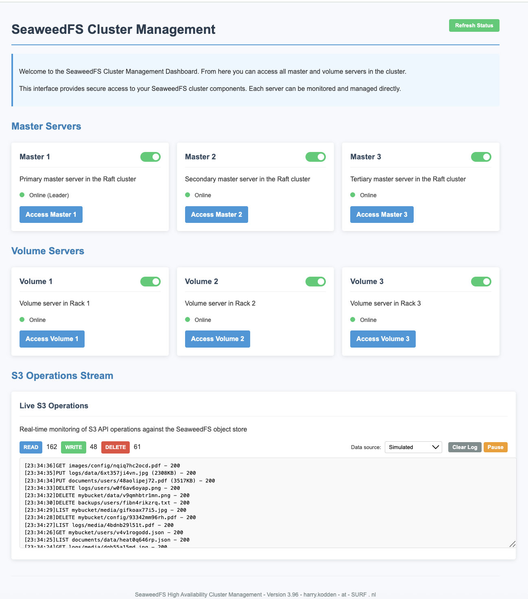

# SeaweedFS HA Cluster

This repository contains configuration files and scripts to set up a High Availability (HA) SeaweedFS cluster with a user-friendly management dashboard.

On this dashboard you can manipulate the cluster, turn nodes on/off ans see how the cluster recovers from that. The S3 operations are continueously processed.



## Architecture

The setup includes:
- 3 Master servers in a Raft cluster for high availability
- 3 Volume servers across different "racks" for data redundancy
- 2 Filer servers for metadata management and redundancy
- Nginx as a reverse proxy for easy access and load balancing
- S3-compatible API for standard object storage access

## Port Assignments

- `9080`: Filer server access
- `9333`: S3 API endpoint
- `9500`: Cluster Management Dashboard (password protected)

## Setup Instructions

1. Clone this repository:
   ```bash
   git clone https://github.com/HarryKodden/SeaWeedFS-HA-Demo.git
   cd SeaWeedFS-HA-Demo
   ```

2. Run the setup script:
   ```bash
   ./setup_cluster.sh [username] [password] [domain]
   ```
   This will:
   - Create authentication credentials
   - Generate S3 API keys
   - Create a `.env` file with configuration
   - Start the SeaweedFS HA cluster with Docker Compose

3. Test the cluster setup:
   ```bash
   ./test_cluster.sh
   ```

## Management Dashboard

A user-friendly cluster management dashboard is available at:
```
http://localhost:9500/
```

Authentication is required using the credentials specified during setup (default: admin/seaweedadmin).

The dashboard provides:
- One-click access to all master and volume servers
- Status monitoring of each component
- Quick overview of the cluster health

## File Structure

- `docker-compose.yml`: Container definitions and networking
- `nginx.conf`: Reverse proxy configuration
- `setup_cluster.sh`: Initial setup script
- `test_cluster.sh`: Cluster validation script
- `html/cluster.html`: UI for the management dashboard
- `.env`: Environment variables (created during setup)

## S3 API Usage

The S3 API is accessible at `http://localhost:9333/` and can be used with standard S3 tools like AWS CLI:

```bash
AWS_ACCESS_KEY_ID="your_key_id" \
AWS_SECRET_ACCESS_KEY="your_secret_key" \
aws --endpoint-url http://localhost:9333 s3 ls
```

## Troubleshooting

If you encounter issues:

1. Check the container logs:
   ```bash
   docker compose logs
   ```

2. Verify the nginx configuration:
   ```bash
   docker exec demo-nginx-1 nginx -t
   ```

3. Test connectivity to individual components:
   ```bash
   curl http://localhost:9080/  # Filer
   curl -u username:password http://localhost:9500/  # Cluster Admin
   ```
